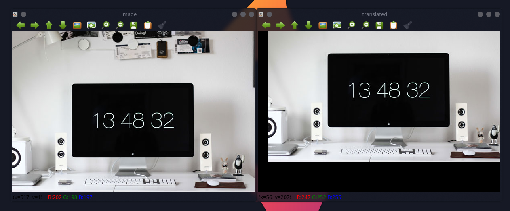
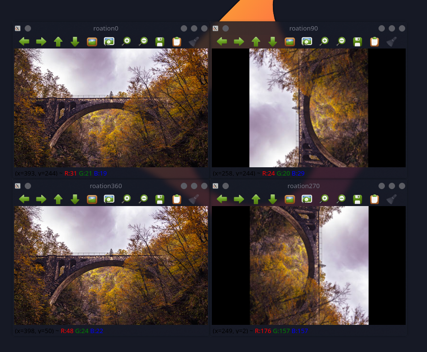
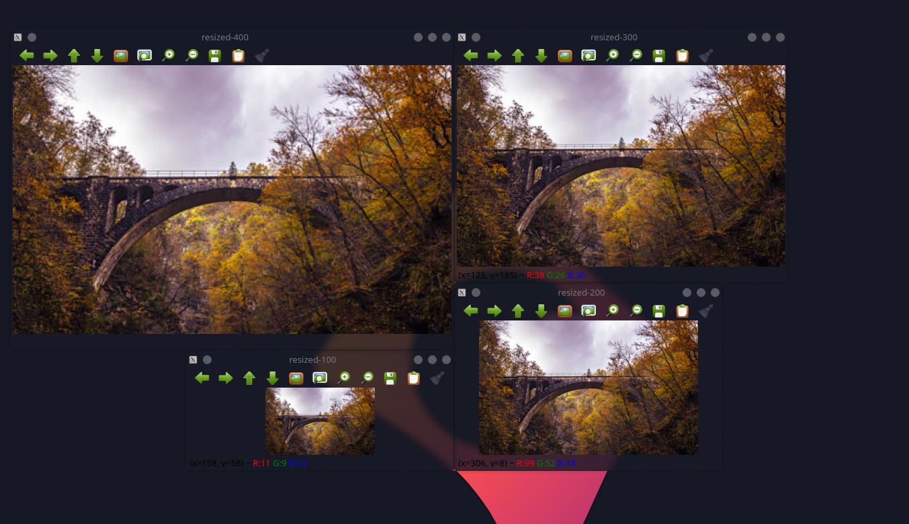
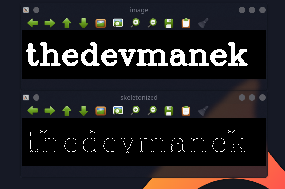
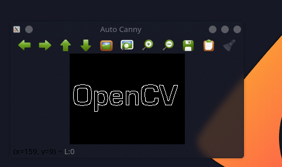
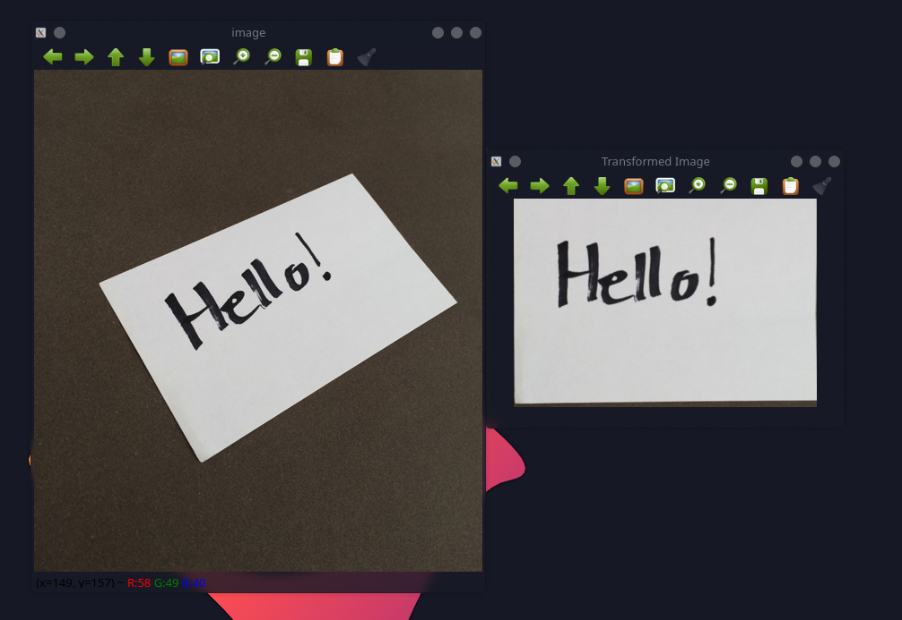

# imutils-cpp

<!-- Version and License Badges -->


[](https://github.com/thedevmanek/imutils-cpp/actions/workflows/doxygen-gh-pages.yml)
[](https://github.com/thedevmanek/imutils-cpp/actions/workflows/pages/pages-build-deployment)
<br/>
This is a cpp implementation of popular python library [imutils](https://github.com/PyImageSearch/imutils)

You can find installation instructions [here](#Installation)

## Translation
Translation is the shifting of an image in either the *x* or *y* direction. To translate an image in OpenCV you would need to supply the *(x, y)*-shift, denoted as *(t<sub>x</sub>, t<sub>y</sub>)* to construct the translation matrix *M*:


And from there, you would need to apply the `cv::warpAffine` function.

Instead of manually constructing the translation matrix *M* and calling `cv2::warpAffine`, you can simply make a call to the `translate` function of `imutils`.

#### Example:
<pre>
 // translate the image x=25 pixels to the right and y=75 pixels up
 cv::Mat translated =Convenience::translate(image,25,-75);
</pre>

#### Output:



## Rotation
Rotating an image in OpenCV is accomplished by making a call to `cv2::getRotationMatrix2D` and `cv2::warpAffine`. Further care has to be taken to supply the *(x, y)*-coordinate of the point the image is to be rotated about. These calculation calls can quickly add up and make your code bulky and less readable. The `rotate` function in `imutils` helps resolve this problem.

#### Example:
<pre>
// loop over the angles to rotate the image
    int arr[]={0,90,270,360};
    for(int i:arr){
        cv::Mat rotated = Convenience::rotate(image,i);
        std::string windowname ="rotation";
        windowname+=std::to_string(i);
        cv::imshow(windowname,rotated);
    }</pre>


## Resizing
Resizing an image in OpenCV is accomplished by calling the `cv::resize` function. However, special care needs to be taken to ensure that the aspect ratio is maintained.  This `resize` function of `imutils` maintains the aspect ratio and provides the keyword arguments `width` and `height` so the image can be resized to the intended width/height while (1) maintaining aspect ratio and (2) ensuring the dimensions of the image do not have to be explicitly computed by the developer.

Another optional keyword argument, `inter`, can be used to specify interpolation method as well.

#### Example:
<pre>
// loop over varying widths to resize the image to
int arr[]={400,300,200,100};
    for(int i:arr){
        cv::Mat resized = Convenience::resize(image,i);
        std::string windowname ="resized-";
        windowname+=std::to_string(i);
        cv::imshow(windowname,resized);
    }</pre>


## Skeletonization
Skeletonization is the process of constructing the "topological skeleton" of an object in an image, where the object is presumed to be white on a black background. OpenCV does not provide a function to explicitly construct the skeleton, but does provide the morphological and binary functions to do so.

For convenience, the `skeletonize` function of `imutils` can be used to construct the topological skeleton of the image.

The first argument, `size` is the size of the structuring element kernel. An optional argument, `structuring`, can be used to control the structuring element -- it defaults to `cv::MORPH_RECT`	, but can be any valid structuring element.

#### Example:
<pre>
// skeletonize the image
cv::Mat img = cv::Mat::zeros({500,100}, CV_32F);
cv::putText(img,"thedevmanek",{5,70},cv::FONT_HERSHEY_COMPLEX,2,{255},5,cv::LINE_AA);
cv::Mat img_copy = img.clone();
cv::Mat skeletonized = Convenience::skeletonize(img,{3,3},cv::MORPH_ELLIPSE);</pre>

#### Output:



## URL to Image
This the `url_to_image` function accepts a single parameter: the `url` of the image we want to download and convert to  `cv::Mat` in OpenCV format.

#### Example:
<pre>std::string url="https://opencv.org/wp-content/uploads/2020/07/cropped-OpenCV_logo_white_600x.png";
cv::Mat logo = Convenience::urlToImager(url);
cv::imshow("urlImage",logo);</pre>

#### Output:


## Automatic Canny Edge Detection
The Canny edge detector requires two parameters when performing hysteresis. However, tuning these two parameters to obtain an optimal edge map is non-trivial, especially when working with a dataset of images. Instead, we can use the `autoCanny` function which uses the median of the grayscale pixel intensities to derive the upper and lower thresholds.

#### Example:
<pre>
   cv::Mat autoCanny = Convenience::autoCanny(image);
   cv::imshow("Auto Canny",autoCanny);</pre>

#### Output:



## 4-point Perspective Transform
A common task in computer vision and image processing is to perform a 4-point perspective transform of a ROI in an image and obtain a top-down, "birds eye view" of the ROI. The `perspective` module takes care of this for you.

#### Example
<pre>
    cv::Mat fourPointTransformed = Perspective::fourPointTransformation(image,{{73, 239},{356, 117}, {475, 265}, {187, 443}});
    cv::imshow("image",image);
    cv::imshow("Transformed Image",fourPointTransformed);
</pre>

#### Output:




## (Recursively) Listing Paths to Images
The `paths` sub-module of `imutils` includes a function to recursively find images based on a root directory.

#### Example:
Assuming we are in the `demos` directory, let's list the contents of the `../demo_images`:

```
Path path;
std::vector<std::string> dirs= path.listImages("../demo_images");
for(std::string file:dirs){
    std::cout<<file<<std::endl;
```

#### Output:
<pre>../demo_images/opencv-logo.png
../demo_images/cactus.jpg
../demo_images/shapes.png
../demo_images/bridge.jpg
../demo_images/folder with spaces/bridge.jpg
../demo_images/workspace.jpg
../demo_images/elephant.jpeg
../demo_images/notecard.png
</pre>

<a name="Installation">
 
## Installation

</a>

This library is dependent on [opencv](https://github.com/opencv/opencv) and [curl](https://github.com/curl/curl)
libraries

### Dynamic Library for local use

<pre> 
$ cp /home/usr/Download/libimutils_cpp.so /home/usr/lib
</pre>
or
<pre> 
$ cp /usr/Download/libimutils_cpp.so.1.0.1 /usr/lib
$ ldconfig -n -v /usr/lib
</pre>

### Static Library

Just install the .a file in the lib dir or the root dir of the project

## Usage

### Dynamic Library

<pre>
g++ -Wall -L/opt/lib main.cpp -limutils_cpp
</pre>

### Static Library

<pre>
$ g++ main.cpp libfoo.a
</pre>
or
<pre>
$ g++ -L. -lfoo prog.cpp libfoo.a
</pre>

## CMAKE

### Dynamic

<pre>
target_link_libraries(imutils_cpp ${OpenCV_LIBS} curl)
</pre>

### Static

<pre>
target_link_libraries(main ${CMAKE_SOURCE_DIR}/libimutils_cpp.a)
</pre>
